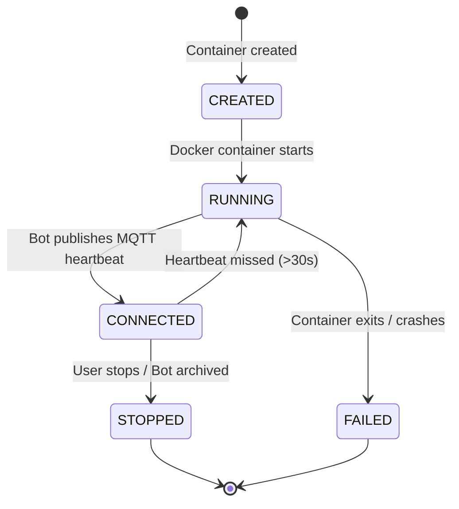

# Architecture Overview

This document describes the internal structure, design patterns, and high-level architecture of the **hummingbot-api** project.

---

## 1. System Architecture

The Hummingbot API is designed to manage the lifecycle of decentralized trading bots using Docker, communicate with them via MQTT, and provide real-time updates to clients via WebSockets.

```mermaid
graph TD
    Client[Client / UI / AI Assistant]
    API[FastAPI Server]
    DB[(PostgreSQL)]
    Broker((EMQX MQTT Broker))
    Docker[Docker Daemon]
    Gateway[Gateway DEX Trading]

    subgraph Bot Instances
        Bot1[Hummingbot Instance 1]
        Bot2[Hummingbot Instance 2]
    end

    Client -- HTTP/REST --> API
    Client -- WebSockets --> API
    API -- Reads/Writes state --> DB
    API -- Deploys/Monitors --> Docker
    Docker -- Creates/Runs --> Bot Instances
    API -- Publishes Commands --> Broker
    Bot Instances -- Publishes Telemetry --> Broker
    API -- Subscribes to Status/Logs --> Broker
    Bot Instances -- Trade Executions --> Gateway
```

**Core Components:**
- **FastAPI**: Provides HTTP/REST endpoints and WebSockets for clients.
- **Docker**: Manages the lifecycle of Hummingbot containers.
- **EMQX (MQTT Broker)**: The primary async communication bus between the API and running bots.
- **PostgreSQL**: Persistent storage for bot run history, configurations, and state tracking.

---

## 2. Repository Layout

```
routers/          HTTP + WebSocket route handlers (one file per domain)
services/         Business logic services
  bots_orchestrator.py     Docker + MQTT bot lifecycle, pending_bots registry
  docker_service.py        Docker SDK wrapper, container health/logs
  executor_ws_manager.py   WebSocket push loops for all /ws/executors subscriptions
  websocket_manager.py     WebSocket push loops for /ws/market-data
models/           Pydantic request/response models
database/
  models.py                SQLAlchemy ORM models
  repositories/            Async repository classes (one per domain)
bots/
  controllers/             Strategy controller configs and implementations
  credentials/             Per-account encrypted credentials (gitignored)
  conf/                    Script and controller YAML configs
docs/                      Developer documentation
main.py                    FastAPI app, lifespan startup/shutdown
deps.py                    FastAPI dependency injection helpers
config.py                  Pydantic Settings (reads from .env)
```

---

## 3. Bot Lifecycle State Machine

Bots follow a strict state machine from deployment to termination. The API uses a combination of Docker container health and MQTT heartbeats to determine the real-time status of a bot.



1. **CREATED**: Container created, database record initialized.
2. **RUNNING**: Health check confirms container is up and running.
3. **CONNECTED**: MQTT handshake successful (bot is now controllable).
4. **STOPPED/ARCHIVED**: Container removed, logs saved, state persisted.

**Deployment Flow:**
1. User calls the deploy endpoint (`/bot-orchestration/deploy-v2-controllers`).
2. API creates a Docker container and a `BotRun` record in the database.
3. The bot is added to an in-memory `pending_bots` registry (shows as `deploying`).
4. Once the container is running and the bot connects to MQTT, it publishes a heartbeat.
5. The API receives the heartbeat, removes the bot from `pending_bots`, and marks it as fully active.

---

## 4. Key Design Patterns

### Dependency Injection
Services are initialized in `main.py`'s `lifespan()` and attached to `app.state.*`.
`deps.py` exposes them as FastAPI `Depends()` callables.

### Pending Bots Registry
`BotsOrchestrator.pending_bots` is an in-memory registry that tracks bots from deployment until they are discovered by MQTT. This ensures immediate visibility in the UI with a `deploying` status.

### WebSocket Subscription Pattern
Implemented in `services/executor_ws_manager.py` and `services/websocket_manager.py`. Uses asyncio push loops with hash-based change detection to minimize bandwidth.
Each subscription type (e.g., `bot_deployment`, `performance`) has a dedicated push loop function.

---

## 5. HTTP Endpoints

The API categorizes its REST endpoints using FastAPI routers. Here are the primary domains available:

**Bot Orchestration & Lifecycle (`/bot-orchestration`)**
- `POST /deploy-v2-controllers` / `POST /deploy-v2-script`: Deploy new bot instances.
- `GET /status` / `GET /{bot_name}/status`: Check status of all bots or a specific bot.
- `POST /start-bot` / `POST /stop-bot` / `POST /stop-and-archive-bot/{bot_name}`: Control bot execution.
- `GET /bot-runs`: Retrieve historical records of deployed bots.

**Docker Management (`/docker`)**
- `POST /start-container/{name}` / `POST /stop-container/{name}`
- `POST /pull-image/` / `GET /pull-status/`

**Executors & Performance (`/executors`)**
- `POST /search` / `GET /summary`: List active execution modules running inside bots.
- `GET /performance`: Retrieve unified performance metrics across bots.
- `GET /{executor_id}/logs`: Retrieve specific executor logs.

**Market Data & Trading (`/market-data`, `/trading`, `/portfolio`)**
- Endpoints to fetch candles, order books, placed orders, and portfolio balances.

**Gateway & DeFi (`/gateway`, `/gateway/clmm`, `/gateway/swap`)**
- Endpoints to interact with Decentralized Exchanges (quotes, swaps, liquidity provisions).

---

## 6. WebSocket Endpoints (Real-time Streaming)

WebSockets are used to push real-time updates using a `subscribe` / `unsubscribe` JSON RPC pattern. Data is only pushed when hashes change to save bandwidth.

**`ws://localhost:8000/ws/market-data`**
- Subscriptions: `candles`, `order_book`, `trades`.

**`ws://localhost:8000/ws/executors`**
- Subscriptions:
  - `bot_deployment`: Traces a bot container from creation to `running` or `failed` state.
  - `bot_status` / `all_bots_status`: Real-time status of bots.
  - `executor_logs`: Streams live logs for specific executors.
  - `performance` / `positions`: Live updates on PnL and active positions.

---

## 7. Bot Commands via MQTT

The API communicates with running bots using an MQTT Topic structure (`hbot/{bot_id}/{channel}`).

**API Publishes to (Outgoing Commands):**
- `hbot/{bot_id}/start`: Tells the bot to start a specific script/config.
- `hbot/{bot_id}/stop`: Tells the bot to halt trading.
- `hbot/{bot_id}/config`: Modifies live configuration parameters.
- `hbot/{bot_id}/import_strategy`: Instructs the bot to load a new strategy.
- `hbot/{bot_id}/history`: Request trading history. This uses an **RPC pattern** where the API includes a `reply_to` topic (`hummingbot-api/response/{timestamp}`) and waits for the bot's response.

**API Subscribes to (Incoming Telemetry):**
- `hbot/+/hb`: Heartbeats (`hb`). Used for auto-discovery. If a heartbeat is missed for 30s, the bot is considered offline.
- `hbot/+/status_updates`: Operational status changes.
- `hbot/+/performance`: Live strategy metrics and custom controller info.

---

## 8. Logs, Status, and Error Streaming

The API handles log streaming and error capture robustly:

- **Log Streaming**: Bots publish application logs to their `hbot/{bot_id}/log` topic. The API deduplicates these logs using a 5-minute Time-to-Live (TTL) cache to prevent spamming the client. Users stream these via the `executor_logs` WebSocket subscription.
- **Status Streaming**: The `bot_deployment` WS subscription combines Docker health checks and MQTT discovery. If a bot starts but fails immediately (e.g., bad API keys), the WS pushes a `failed` status.
- **Error Capture**: If a Docker container exits with a non-zero code, the API automatically scrapes the container's exit logs and saves them to the `error_message` field in the `BotRun` PostgreSQL table. This allows users to review crash diagnostics long after the container has been destroyed.

---

## 9. BotRun Model
The `BotRun` DB model tracks every deployment:
- `run_status`: `CREATED`, `RUNNING`, `STOPPED`, `ERROR`
- `deployment_status`: `DEPLOYED`, `FAILED`, `ARCHIVED`
- `error_message`: Captures startup failures and Docker logs.
