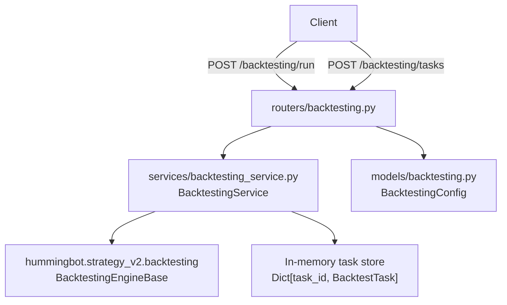

# Backtesting Implementation

The backtesting system in the `hummingbot-api` is a self-contained module that orchestrates the execution of strategies against historical data using the Hummingbot V2 engine.

## Architecture

The system follows a three-layer architecture: **API Router → Service → Hummingbot Engine**.

---

## 1. Request Model — `models/backtesting.py`

The `BacktestingConfig` Pydantic model defines the parameters required to trigger a backtest:

| Field | Default | Purpose |
|---|---|---|
| `start_time` | `1735689600` (2025-01-01) | Unix epoch start time |
| `end_time` | `1738368000` (2025-02-01) | Unix epoch end time |
| `backtesting_resolution` | `"1m"` | Candle granularity (e.g., 1m, 5m, 1h) |
| `trade_cost` | `0.0006` | Simulated fee rate (e.g., 0.06%) |
| `config` | *(required)* | Controller configuration (YAML file path or dict) |

---

## 2. API Router — `routers/backtesting.py`

The router provides endpoints for running backtests and managing background tasks. All endpoints are protected by user authentication.

### Execution Modes

- **Synchronous (`POST /backtesting/run`)**: Executes the backtest within the request lifecycle. Useful for short backtests, but may trigger HTTP timeouts for complex strategies or long timeframes.
- **Asynchronous (`POST /backtesting/tasks`)**: Submits the backtest as a background task and returns a `task_id`. This is the recommended way for most backtests.

### Task Management

- `GET /backtesting/tasks`: Returns a list of all current tasks (metadata only).
- `GET /backtesting/tasks/{task_id}`: Returns the status and results (if completed) for a specific task.
- `DELETE /backtesting/tasks/{task_id}`: Cancels a running task or removes a completed task from memory.

---

## 3. Backtesting Service — `services/backtesting_service.py`

The `BacktestingService` is the core orchestrator, initialized as a singleton during the application startup.

### Task Lifecycle

Tasks move through the following states:
`PENDING` → `RUNNING` → `COMPLETED` | `FAILED` | `CANCELLED`

### Core Logic (`_execute_backtest`)

1. **Config Resolution**: It determines if the provided `config` is a path to a YAML file or an inline dictionary and instantiates the appropriate controller configuration.
2. **Engine Delegation**: It calls `BacktestingEngineBase.run_backtesting()` from the Hummingbot package.
3. **Result Serialization**: It processes the raw engine results into a serialized format containing:
   - `executors`: Detailed list of all simulated executors.
   - `processed_data`: The feature set used by the strategy.
   - `results`: Performance metrics (PnL, Sharpe Ratio, etc.).
   - `position_holds`: Aggregated data for open and closed positions.
   - `timeseries`: PnL and position-held data for charting.

### Memory & Cleanup

- **In-Memory Store**: Tasks and results are stored in a dictionary in memory. They are **not persisted** to the database and will be lost on server restart.
- **Auto-Cleanup**: The service maintains a maximum of 50 tasks. When the limit is reached, it automatically evicts the oldest completed or failed tasks.
